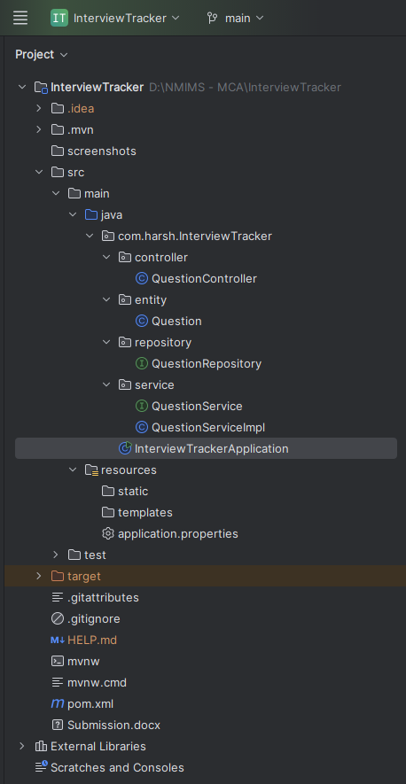
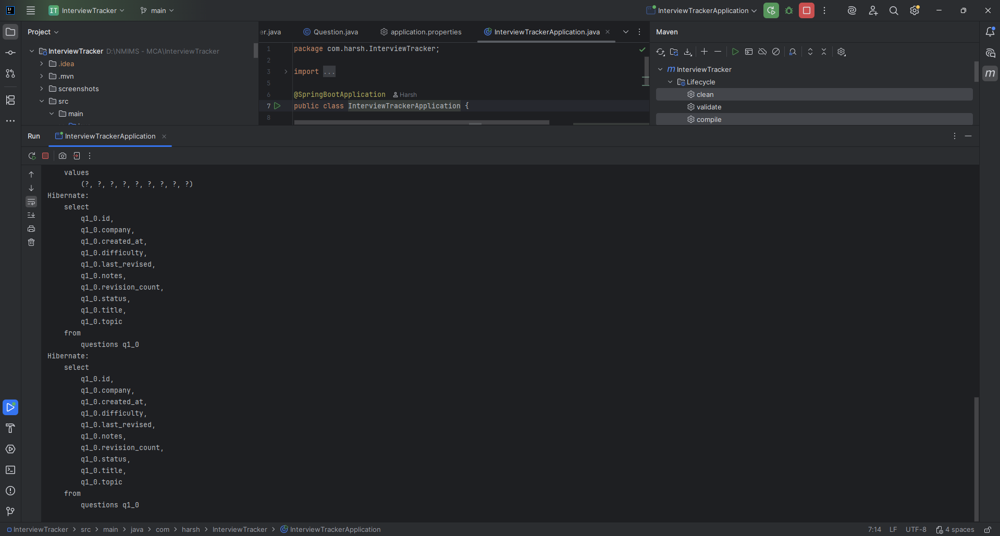
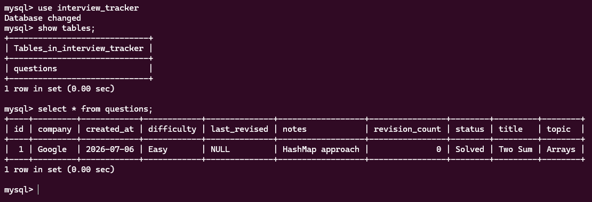
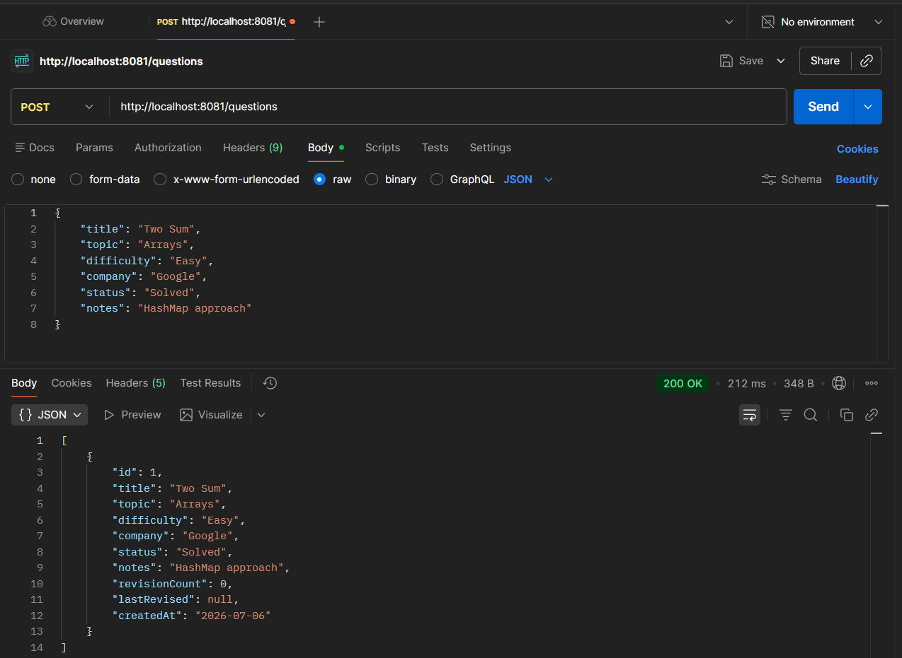
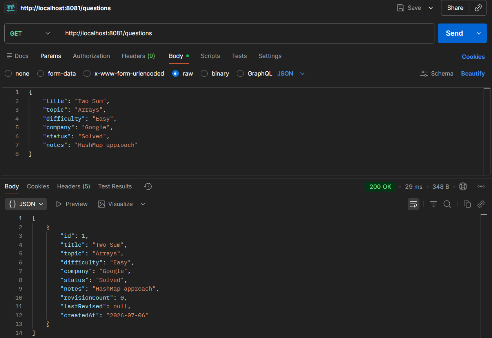

# 📚 Interview Question Tracker

A **Spring Boot REST API** application developed to help users organize and manage coding interview questions. The application supports complete CRUD operations along with search functionality based on company, topic, difficulty, and status.

> **Developed as a Java Spring Boot Project for Academic Submission**

---

# 📸 Project Screenshots

## 🏗️ Project Structure



---

## ▶️ Application Running



---

## 🗄️ MySQL Database



---

## 📥 POST Request (Create Question)



---

## 📤 GET Request (Fetch Questions)



---

# 🚀 Features

- Add Interview Questions
- View All Questions
- Search Question by ID
- Update Existing Questions
- Delete Questions
- Search by Company
- Search by Topic
- Filter by Difficulty
- Filter by Status
- MySQL Database Integration
- RESTful API Architecture

---

# 🛠️ Technologies Used

- Java 17
- Spring Boot
- Spring MVC
- Spring Data JPA
- REST API
- MySQL
- Maven
- IntelliJ IDEA
- Postman

---

# 🏛️ Project Architecture

```
               Client (Postman)
                      │
                      ▼
          QuestionController
                      │
                      ▼
            QuestionService
                      │
                      ▼
         QuestionRepository
                      │
                      ▼
              MySQL Database
```

The project follows the **Controller → Service → Repository → Database** layered architecture.

---

# 📂 Project Structure

```
InterviewTracker
│
├── controller
│     └── QuestionController.java
│
├── service
│     ├── QuestionService.java
│     └── QuestionServiceImpl.java
│
├── repository
│     └── QuestionRepository.java
│
├── entity
│     └── Question.java
│
├── dto
├── exception
├── config
│
├── resources
│     └── application.properties
│
└── InterviewTrackerApplication.java
```

---

# 🗄️ Database Schema

### Table : `questions`

| Column | Data Type |
|---------|-----------|
| id | Long |
| title | String |
| topic | String |
| difficulty | String |
| company | String |
| status | String |
| notes | String |
| revisionCount | Integer |
| lastRevised | Date |
| createdAt | Date |

---

# 🌐 REST API Endpoints

| Method | Endpoint | Description |
|---------|----------|-------------|
| POST | `/questions` | Add a new question |
| GET | `/questions` | Get all questions |
| GET | `/questions/{id}` | Get question by ID |
| PUT | `/questions/{id}` | Update question |
| DELETE | `/questions/{id}` | Delete question |
| GET | `/questions/company/{company}` | Search by company |
| GET | `/questions/topic/{topic}` | Search by topic |
| GET | `/questions/difficulty/{difficulty}` | Search by difficulty |
| GET | `/questions/status/{status}` | Search by status |

---

# 📥 Sample POST Request

```json
{
  "title": "Two Sum",
  "topic": "Arrays",
  "difficulty": "Easy",
  "company": "Google",
  "status": "Solved",
  "notes": "Use HashMap approach"
}
```

---

# 📤 Sample Response

```json
{
  "id": 1,
  "title": "Two Sum",
  "topic": "Arrays",
  "difficulty": "Easy",
  "company": "Google",
  "status": "Solved",
  "notes": "Use HashMap approach",
  "revisionCount": 0,
  "lastRevised": null,
  "createdAt": "2026-07-06"
}
```

---

# ⚙️ How to Run the Project

## 1️⃣ Clone the Repository

```bash
git clone https://github.com/<YOUR_GITHUB_USERNAME>/InterviewTracker.git
```

## 2️⃣ Create MySQL Database

```sql
CREATE DATABASE interview_tracker;
```

## 3️⃣ Configure Database

Update `application.properties`

```properties
spring.datasource.url=jdbc:mysql://localhost:3306/interview_tracker
spring.datasource.username=root
spring.datasource.password=YOUR_PASSWORD
```

## 4️⃣ Run the Application

Run

```
InterviewTrackerApplication.java
```

or

```bash
mvn spring-boot:run
```

The application will start on

```
http://localhost:8081
```

---

# 🧪 API Testing

The APIs were tested using **Postman**.

### Create Question

```
POST http://localhost:8081/questions
```

### Get All Questions

```
GET http://localhost:8081/questions
```

### Get Question by ID

```
GET http://localhost:8081/questions/1
```

### Update Question

```
PUT http://localhost:8081/questions/1
```

### Delete Question

```
DELETE http://localhost:8081/questions/1
```

---

# 🎯 Learning Outcomes

This project demonstrates:

- Spring Boot Application Development
- Spring MVC Architecture
- REST API Development
- CRUD Operations
- Spring Data JPA
- MySQL Database Integration
- Repository Pattern
- Service Layer
- Controller Layer
- Layered Architecture

---

# 👨‍💻 Developer

**Harsh Makwana**

Master of Computer Applications (MCA)

NMIMS MPSTME

---

# 📄 License

This project was developed for educational and academic submission purposes.
